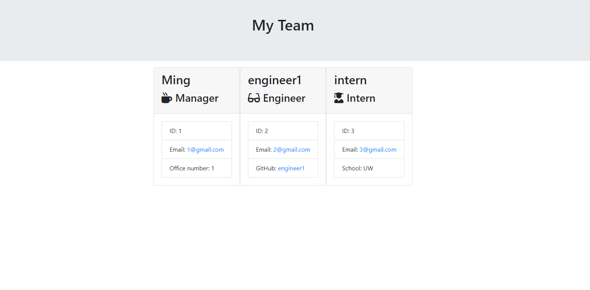

# 10 Object-Oriented Programming: Team Profile Generator

## Your Task

Your task is to build a Node.js command-line application that takes in information about employees on a software engineering team, then generates an HTML webpage that displays summaries for each person. Testing is key to making code maintainable, so you’ll also write a unit test for every part of your code and ensure that it passes each test.

Because this application won’t be deployed, you’ll need to provide a link to a walkthrough video that demonstrates its functionality and all of the tests passing. You’ll need to submit a link to the video AND add it to the readme of your project.

> **Note**: There is no starter code for this assignment.

## User Story

```md
AS A manager
I WANT to generate a webpage that displays my team's basic info
SO THAT I have quick access to their emails and GitHub profiles
```

https://drive.google.com/file/d/1qzJLyQsI2QGgZxs67dP0X8E7gdJ50n-Q/view

https://github.com/zmzhong1/Team-Profile-Generator

